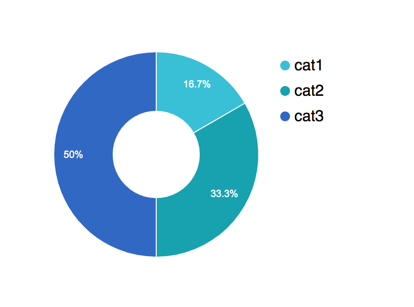
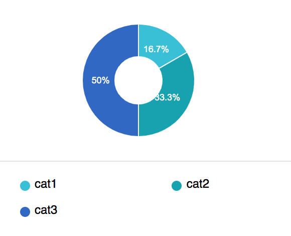

# Graphgen

### Version information
Version: 1.0.0

### Contact information

Contact : Kasisto

Contact Email : info@kasisto.com

# Introduction

Graphgen is a service that takes a number of arguments (such as the type of the graph, information about each data point, etc) and create an HTML page displaying the provided information in a graph rendered by the Google Charts library.


# Pie Chart

This endpoint takes a param called data (full of data key-value pairs of data to be graphed) and renders the information as a Pie Chart.

>An Example of a call to create a pie chart of three categories (cat1, cat2, and cat3). 

```shell
curl https://graphgen.kitsys.net/charts/pie_chart?data=cat1|1,cat2|2,cat3|3
```

>This will return a webpage that renders the provided data in a Pie Chart

>

## HTTP Request

`GET https://graphgen.kitsys.net/charts/pie_chart`

## Query Parameters

Parameter |  Description
--------- |  -----------
data |  a CSV (comma separated value) map of key-value pairs where key's are strings and values are numbers. This field should be URL encoded

# Pie Chart Bottom

This endpoint is similar to `Pie Chart` but keys are displayed below the pie chart as opposed to the right of the pie chart. Like `Pie Chart`, the endpoint takes a param called data (full of data key-value pairs of data to be graphed) and renders the information as a Pie Chart.

>An Example of a call to create a pie chart of three categories (cat1, cat2, and cat3). 

```shell
curl https://graphgen.kitsys.net/charts/pie_chart_bottom?data=cat1|1,cat2|2,cat3|3
```

>This will return a webpage that renders the provided data in a Pie Chart

>

## HTTP Request

`https://graphgen.kitsys.net/charts/pie_chart_bottom`

## Query Parameters

Parameter |  Description
--------- |  -----------
data |  a CSV (comma separated value) map of key-value pairs where key's are strings and values are numbers. This field should be URL encoded


